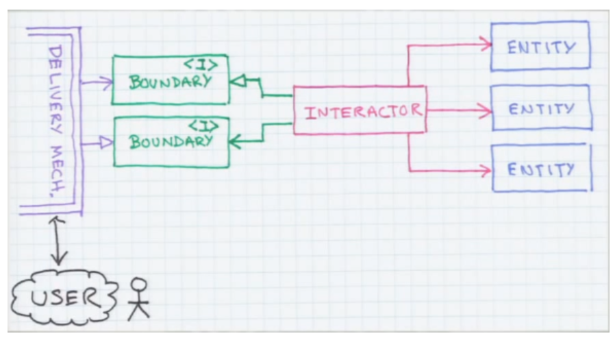

# Use Case

만들고자 하는 시스템(혹은 서비스)을 사용하는 클라이언트라 그 시스템을 통해 하고자 하는 것

클린 아키텍처에서 말하는 좋은 아키텍처란,

아키텍처(설계도)가 그 시스템이 하고자 하는 것을 설명해야 한다는 것

서비스가 클라이언트에게 어떤 기능을 제공해주는지 말해줄 수 있어야 좋은 아키텍처

- 좋은 아키텍처를 만들기 위해서는 Use case가 안정적으로 잘 만들어져 있어야 하고, 그 외 도구들은 언제든지 바뀔 수 있으므로, 결합도를 최대한 낮추는 것(loose couplling)이 중요하다.

- 위 이미지에서 Interactor가 Use case라고 생각, Interactor와 Use case는 일대일 매칭되며 하나의 서비스에는 여러 Interactor가 있을 수 있다.
- Interactor가 사용하는 Entity들은, Use case를 처리하기 위해 필요한 요소들이라 생각하면 된다. 영화 예매를 예로 들면, 우리가 서비스 시스템을 객체지향적으로 설계한다고 했을 때, ‘영화 예매’라는 로직을 처리하기 위해 ‘영화’, ‘상영’, ‘손님’, ‘비용’ 등 객체를 구성하고, 그 객체들의 협력으로 구조를 만들 수 있을 것이다.
- 그리고 Use case와 툴을 포함한 그 외 외부를 나누기 위해서, 이미지에서 표현한 것과 같이 Boundary라는 인터페이스를 둔다. 해당 인터페이스를 통해 Use case로 들어오는 요청을 모두 같은 형태로 들어오도록 만들고, Use case로부터 응답이 나갈 때도 항상 정해진 형태로 나갈 수 있도록 한다.