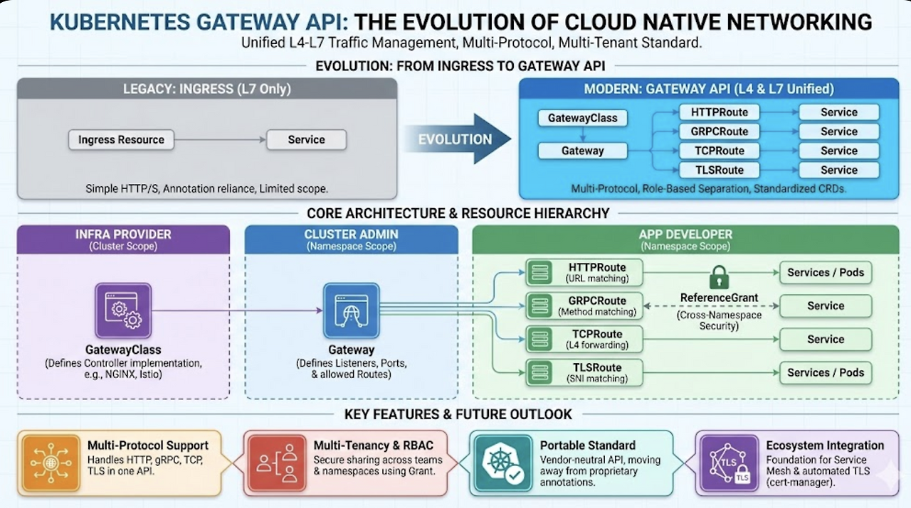

Gateway API는 네트워크 트래픽을 외부로부터 클러스터 내부의 서비스로 안전하고 유연하게 전달하기 위한 새로운 표준 API 리소스 집합

전통적으로 Ingress 리소스를 통해 HTTP/HTTPS 요청을 클러스터 내부 서비스로 라우팅했지만, 기능 확장에 한계가 있고 L4(Transport Layer) 수준의 트래픽이나 멀티 프로토콜, 고급 라우팅 제어를 지원하기 어렵다는 단점을 해결하기 위해 탄생

### Gateway API 의 목적
L4~L7 트래픽을 모두 지원하는 유연한 아키텍처

멀티 테넌시 및 보안 분리 구조 지원

컨트롤러 벤더 독립적인 표준화된 API

Cloud Provider, Service Mesh, API Gateway 등 다양한 환경에서 통합 가능

선언적 구성(Helm/Kustomize)에 적합한 구조

### 핵심 리소스 구조
GatewayClass : 인프라 제공자가 정의하는 Gateway 구현 클래스

Gateway : 실제 L4/L7 트래픽을 수신하는 리소스

Route : 서비스로 트래픽을 라우팅하는 규칙

ReferencePolicy, BackendPoliy : 고급 권한과 정책 제어 리소스

### 해결 문제
단순 HTTP 트래픽 외 TCP, TLS, gRPC 등 다양한 프로토콜을 하나의 Gateway에서 처리

HTTP API는 HTTPRoute, gRPC 서버는 gRPCRouter 등 혼합된 요구를 단일 Gateway에서 처리

서로 다른 팀/서비스 간에 Gateway 자원을 안전하게 공유 가능

cert-manager, Service Mesh 등과 통합해 TLS 자동화 및 보안 구성 간소화

멀티 클러스터 환경에서 Gateway를 통합 API로 추상화하여 외부 진입점 관리

| 항목 | Ingress | Gateway API |
|---|---|---|
| API 안정성 | v1 (Stable) | v1 / v1alpha2 (일부 기능) |
| 지원 프로토콜 | HTTP/HTTPS (L7 전용) | HTTP, HTTPS, gRPC, TCP, TLS (L4~L7 혼합 지원) |
| 라우팅 리소스 | 단일 리소스 (Ingress) | 다중 리소스 (HTTPRoute, TCPRoute, TLSRoute, GRPCRoute) |
| TLS 처리 방식 | Secret 참조 (단순 구성) | certificateRefs로 세분화, 다양한 모드 지원 (Terminate, Passthrough 등) |
| 역할 분리 | 없음 (Ingress 하나로 구성) | GatewayClass / Gateway / Route로 명확히 분리 |
| 멀티 테넌시 | 제한적 (네임스페이스 기반 공유 불명확) | AllowedRoutes로 네임스페이스/권한 범위 제어 |
| 커스텀 확장성 | 제한적 (annotation 기반) | 고도로 유연함 (CRD 기반 확장 및 표준화) |
| 컨트롤러 독립성 | 대부분 NGINX에 종속 (Ingress Controller) | 컨트롤러 선택 가능 (NGINX, Istio, Envoy, GKE, AWS 등) |
| gRPC 지원 | 불완전 (Path 기반 라우팅만) | 완전한 GRPCRoute 지원 (서비스/메서드 기준) |
| L4 지원 (TCP 등) | 미지원 | TCPRoute로 가능 |
| Helm / Kustomize 호환성 | 제한적 구조 | 선언적 구조로 자동화에 용이 |
| 향후 확장성 | 개발 중단 예정 아님, 그러나 제한적 | Kubernetes 공식 차세대 네트워크 표준으로 확장 중 |
