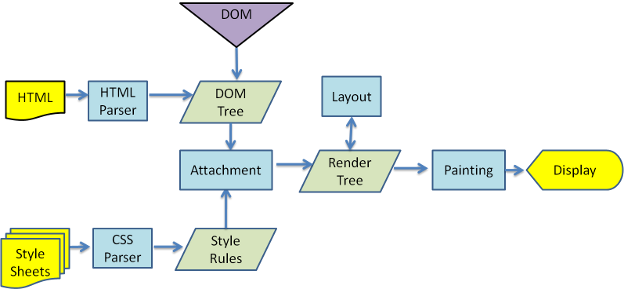

# Vue.js

사용자 인터페이스를 만들기 위한 JavaScript 프레임워크

## 브라우저에서의 렌더링 동작 과정



렌더링은 통신을 통해 요청한 HTML, CSS, JavaScript를 받아서 화면에 뿌려주는 역할

화면에 표시하기 위해서 DOM Tree와 Render Tree 두가지를 필요로 함

1. HTML 문서를 파싱하여 DOM Tree 생성과 동시에 CSS 파싱하여 Style Rules를 만들어냄
2. 만들어진 DOM 노드와 시각 정볼르 연결하여 Render Tree 생성
3. Render Tree 생성이 끝나면 Layout이 시작하는데 이는 각 노드가 화면의 정확한 위치에 표시되는 것을 의미
4. Painting함으로써 화면에 Display 하여 렌더링 과정 종료. 렌더링 엔진은 최선의 사용자 경험을 클어내기 위해 모든 HTML 문서를 파싱하는 데에 기다리지 않고 Layout과 Painting을 함. 즉, 네트워크로부터 모든 내용을 받기 이전에 반든 내용의 일부를 먼저 표시

DOM이 업데이트할 때마다 성능적으로 비용이 많이 듬

이를 해결하기 위해 가상 DOM 사용

**가상DOM**

변화가 일어나면 Virtual DOM을 생성하고 만들어진 Virtual DOM끼리 비교하여 차이점을 파악하여,

해당 차이점만 실제 DOM에 적용

## 특징

### 반응형 데이터(reactive system)

Vue는 데이터가 변경되면 화면이 자동으로 업데이트되는 구조를 가지고 있다.

### 컴포넌트 기반 아키텍처

UI를 독립적인 ‘블록(컴포넌트)’ 단위로 쪼개서 개발

이를 통해 재사용 가능하고, 유지보수가 쉬운 코드 구조 유지

## 핵심 문법

### 데이터 바인딩

**텍스트 바인딩**

```jsx
<div>{{ message }}</div>
```

data 속성 값을 HTML에 바로 삽입

**속성 바인딩**

```jsx

<!-- 축약 -->

```

HTML 태그 속성에 JS 데이터를 연결할 때 v-bind: (또는 :)를 사용

### 디렉티브 사용

조건부 렌더링 : v-if, v-else-if, v-else

반복 렌더링 : v-for

```jsx
<ul>
	<li v-for="item in items" :key="item.id">
	{{ item.text }}
	</li>
</ul>
```

이벤트 핸들링 : v-on

```jsx
<button v-on:click="doSomething">클릭하세요</button>
<!-- 축약 -->
<button @click="doSomething">클릭하세요</button>
```

### computed와 watch

반응형 데이터를 편리하게 다루기 위해 계산된 속성(computed)과 감시자(watch)를 제공

```jsx
export default {
  data() {
    return {
      firstName: '길동',
      lastName: '홍'
    }
  },
  computed: {
    // 계산된 속성
    // 종속된 데이터가 변결될 때만 자동으로 다시 계산되어, 캐싱 기능을 제공
    fullName() {
      return this.lastName + ' ' + this.firstName
      // firstNmae or lastName이 변결될 때만 재계산
    }
  },
  watch: {
    // 데이터 감시
    // 특정 데이터가 변경될 때마다 추가 로직을 수행하고 싶을 때 사용
    firstName(newValue, oldValue) {
      console.log('이름이 변경되었습니다:', oldValue, '->', newValue)
      // 파일 업로드와 같은 무거운 작업이나 API 호출 타이밍 등을 제어하기에 유용
    }
  }
}
```

## 컴포넌트 시스템

컴포넌트는 UI를 여러 블록으로 쪼개고 독립적으로 개발, 유지보수할 수 있게 해줌

### 컴포넌트 등록

```jsx
Vue.component('my-component', {
	template: '<div>커스텀 컴포넌트</div>'
})
```

‘my-component’ : 컴포넌트 이름

template : 해당 컴포넌트가 렌더링될 HTML 구조 정의

### Props 전달

컴포넌트 간 데이터를 주고 받을 때는 props 사용

```jsx
Vue.component('child', {
  props: ['message'],
  template: '<span>{{ message }}</span>'
})
```

```jsx
<child message="안녕하세요!"></child>
```

부모 컨포넌트에서 자식 컴포넌트로 문자열, 숫자, 객체 등 다양한 형태의 데이터 전달 가능

### 이벤트 발신(자식 → 부모)

자식 컴포넌트가 이벤트를 통해 부모에게 메시지 전달 가능

```jsx
// 자식 컴포넌트
methods: {
  notify() {
    this.$emit('alert', '자식이 부모에게 알립니다!')
  }
}
```

```jsx
<!-- 부모 컴포넌트 -->
<child @alert="handleAlert"></child>
```

this.$emit(’이벤트명’, 전달할 데이터) 형태로 자식 → 부모 통신 구현

부모 컴포넌트에서는 이벤트를 청취(listen)할 수 있다.

### 이벤트버스


독립적인 컴포넌트끼리 이벤트를 통신해야할 때 사용

```jsx
├── Root Instance (main.js)
│   ├── 최상위 컴포넌트 (App.vue)
│   │   ├── Component A
│   │   │   ├── Component B
│   │   │   ├── Component C
│   │   │   ├── Component D
```

다음과 같은 트리 구조를 가질 때,

관계없는 Component D와 C 간 eventBus를 사용하여 서로의 버튼 클릭 시,

버튼에 있는 value alert 창을 띄우는 코드를 작성하면 다음과 같다.

```jsx
//main.js

import Vue from 'vue'
import App from './App'
import router from './router'

// 등록을 통해 다른 컴포넌트에서 import하여 eventBus 사용 가능
export const eventBus = new Vue()
Vue.config.productionTip = false

/* eslint-disable no-new */
new Vue({
  el: '#app',
  router,
  components: { App },
  template: '<App/>'
})
```

```jsx
<!--ComponentD-->

<template>
  <div>
    {{ this.textComponentD }}
    <button @click="clickComponentDButton">
      {{ this.ComponentDBtnVaule }}
    </button>
  </div>
</template>

<script>
import { eventBus } from "@/main.js";
export default {
  name: "ComponentD",
  data: function () {
    return {
      textComponentD: "ComponentD 입니다.",
      ComponentDBtnVaule: "D의 버튼",
    };
  },
  created() {
    eventBus.$on("clickComponentCButton", (componentCButtonValue) => {
      window.alert(componentCButtonValue);
    });
  },
  beforeDestroy() {
    eventBus.$off("clickComponentCButton");
  },
  methods: {
    clickComponentDButton() {
      eventBus.$emit("clickComponentDButton", this.ComponentDBtnVaule);
    },
  },
};
</script>
```

```jsx
<!--ComponentC-->

<template>
  <div>
    {{ this.textComponentC }}
    <button @click="clickComponentCButton">
      {{ this.ComponentDBtnVaule }}
    </button>
  </div>
</template>

<script>
import { eventBus } from "@/main.js";
export default {
  name: "ComponentC",
  data: function () {
    return {
      textComponentC: "ComponentC 입니다.",
      ComponentDBtnVaule: "C의 버튼",
    };
  },
  created() {
    eventBus.$on("clickComponentDButton", (componentCButtonValue) => {
      window.alert(componentCButtonValue);
    });
  },
  beforeDestroy() {
    eventBus.$off("clickComponentDButton");
  },
  methods: {
    clickComponentCButton() {
      eventBus.$emit("clickComponentDButton", this.ComponentDBtnVaule);
    },
  },
};
</script>
```

## LifeCycle

각 훅을 적절히 활용해 API 호출 시점이나 이벤트 등록/해제, 메모리 정리 등을 수행


### beforeCreate

컴포넌트 인스턴스가 초기화 될 때 실행

data(), computed와 같은 다른 옵션을 처리하기 전에 즉시 호출

### created

컴포넌트 인스턴스가 초기화를 완료한 후 호출되는 훅

data를 추적하는 것이 가능할 뿐 아니라 props, methods, computed, watch가 활성화되어 접근 가능

DOM에 추가되지 않았기 때문에 data에 직접 접근하여 컴포넌트 초기에 외부에서 받아온 값들을 data로 세팅해야 할 때 이 단계에서 하는 것이 적절함

```jsx
<script>
import { eventBus } from "@/main.js";
export default {
  props: ["propsValue"],
  data: function () {
    return {
      value: "vuejs 입문하기",
      initValue: null,
    };
  },
  created() {
    console.log("created");
    console.log(this.value); // vuejs 입문하기

    eventBus.$on("sendValue", (value) => {
      console.log(value);
    }); //이벤트 받기

    this.initValue = this.propsValue;
    // props value를 data에 정의
  },
};
</script>
```

### mounted

DOM에 컴포넌트가 실제로 삽입된 뒤

$el을 사용하여 실제 DOM에 접근 가능

화면 요소를 제어하는 로직을 수행하기 좋은 단계

### updated

반응형 데이터의 변경으로 DOM이 업데이트된 후

가상 DOM을 렌더링 하고 실제 DOM이 변경된 이후에 호출되는 단계

→ 데이터가 변경되고 나서 가상 DOM으로 다시 화면을 그리고 나면 실행되는 단계

-가상 DOM과 실제 DOM 차이 확인하기

변경된 값들을 가진 DOM을 이용해 접근하고 싶다면 이 때가 적절

updated 훅에서 data를 수정하게 되면 또 update 훅이 호출 되기 때문에 무한 루프에 빠질 수 있으니 주의

### beforeDestroy

인스턴스가 소멸되기 직전에 호출되는 단계

이벤트 리스너를 해체하거나 이벤트 버스를 off 하는 등,

인스턴스가 사라지기 전에 해야할 일들을 처리하는 것이 좋음

### destroyed

컴포넌트가 DOM에서 제거된 후

출처

https://memoryhub.tistory.com/entry/Vue2-%EA%B8%B0%EC%B4%88-%EA%B0%9C%EB%85%90-%EC%99%84%EB%B2%BD-%EA%B0%80%EC%9D%B4%EB%93%9C-%F0%9F%98%8E

https://developerjournal.tistory.com/4

https://d2.naver.com/helloworld/59361